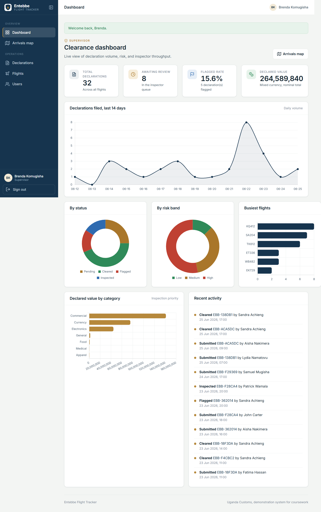

# Entebbe Flight Tracker

A customs declarations application for Entebbe International Airport, built for
Coursework 2 of course 81213 FST (Advanced Application Design and Development),
project scenario 35: *Entebbe Flight Tracker, a customs declarations application
with inspector audit filters.*

Travelers file a customs declaration against an arriving flight before they land.
Customs inspectors work an audit queue, filter declarations by status, risk,
flight, and date, then clear, flag, or mark each one inspected. A supervisor sees
live clearance analytics built from grouped database aggregations.



## Stack

| Layer | Choice |
|-------|--------|
| Frontend | HTML5, CSS3, vanilla JavaScript |
| Charts | Chart.js 4 (loaded from CDN) |
| Backend | Python, Flask (application factory, blueprints) |
| ORM | SQLAlchemy via Flask-SQLAlchemy |
| Database | SQLite locally, Postgres or MySQL in the cloud (one env var) |
| Auth and forms | Flask-WTF (CSRF), Werkzeug password hashing |

The structure follows MVC: models in `app/models.py`, views as Jinja2 templates
in `app/templates/`, and controllers as blueprints in `app/blueprints/`.

## Quick start

You need Python 3.10 or newer.

```bash
# 1. Install dependencies
python -m pip install -r requirements.txt

# 2. Create the database and load demo data
python seed.py

# 3. Run the app
python run.py
```

Open http://127.0.0.1:5000 and sign in with one of the demo accounts below.

### Demo accounts

| Role | Email | Password |
|------|-------|----------|
| Supervisor | `supervisor@entebbe.go.ug` | `Supervisor#2026` |
| Inspector | `patrick@entebbe.go.ug` | `Inspector#2026` |
| Traveler | `aisha@example.com` | `Traveler#2026` |

You can also register a new traveler account from the sign-in page. Self
registration only ever creates travelers; inspector and supervisor accounts are
created by a supervisor from the Users page.

## Features by role

**Traveler**
- Register, sign in, and manage only their own declarations
- File a declaration with multiple goods, category, quantity, and value
- Track clearance status and read inspector notes

**Customs inspector**
- Work the audit queue with combined filters (search, status, risk, flight, date)
- Review the full goods list and audit trail for any declaration
- Clear, flag, or mark a declaration physically inspected, with a note

**Supervisor**
- Clearance dashboard: volume trend, status and risk breakdowns, busiest flights,
  declared value by category, and recent activity
- Manage the flight roster
- Create and deactivate staff accounts

## How the grading criteria are met

- **MVC code and DB quality (35%).** Clear model, view, controller separation.
  Every foreign key is indexed, plus composite indexes for the common inspector
  filters. List views use `joinedload` to fetch related rows in one query, so the
  N+1 trap is avoided. See `app/queries.py`.
- **Defensive security (25%).** Passwords are hashed with PBKDF2 (Werkzeug).
  Access is role based through decorators enforced on every protected route.
  All state-changing requests carry CSRF tokens. Input is validated with WTForms,
  queries are parameterised by the ORM, and Jinja2 autoescaping blocks XSS. See
  `app/security.py` and `app/forms.py`.
- **Analytics fabric (20%).** Dashboard figures come from SQL `GROUP BY`
  aggregations computed in the database, returned as small JSON payloads and drawn
  by Chart.js. See `app/queries.py` and `app/blueprints/api.py`.
- **Deliverable compliance (20%).** Technical report, user manual, and
  screenshots are in `docs/`.

## Project layout

```
flight-tracker/
  app/
    __init__.py          application factory, blueprint registration
    models.py            SQLAlchemy models and indexes
    security.py          login and role-based access decorators
    forms.py             WTForms with validation and CSRF
    queries.py           analytics aggregations, N+1-safe list queries
    services.py          reference generation, risk scoring, audit logging
    blueprints/          auth, traveler, inspector, admin, api controllers
    templates/           Jinja2 views
    static/              css, js (Chart.js wiring), svg assets
  config.py              environment-driven configuration
  run.py                 local entry point
  seed.py                drops, recreates, and seeds the database
  requirements.txt
  docs/                  technical report, user manual, screenshots, review
```

## Cloud deployment notes

The app reads its configuration from environment variables, so no code changes
are needed to deploy. `gunicorn` and `psycopg2-binary` are already in
`requirements.txt`, and a Render blueprint (`render.yaml`) and a `Procfile` are
included.

**One-click on Render:** push to GitHub, then on Render choose New, Blueprint, and
point it at the repo. `render.yaml` provisions a free web service and a managed
Postgres database, generates `SECRET_KEY`, sets `SESSION_COOKIE_SECURE=1`, and
wires `DATABASE_URL` to the database. The start command is
`gunicorn "app:create_app()"` and the health check is `/healthz`.

**Manual on any host:**

1. Set `SECRET_KEY` to a long random value.
2. Provision Postgres and set `DATABASE_URL` (the legacy `postgres://` scheme is
   normalised to `postgresql://` automatically in `config.py`).
3. Set `SESSION_COOKIE_SECURE=1` so cookies are sent only over HTTPS.
4. Create the schema and seed once with `python seed.py`, then serve with
   `gunicorn "app:create_app()"`.

## License

Coursework submission, provided for academic assessment.
