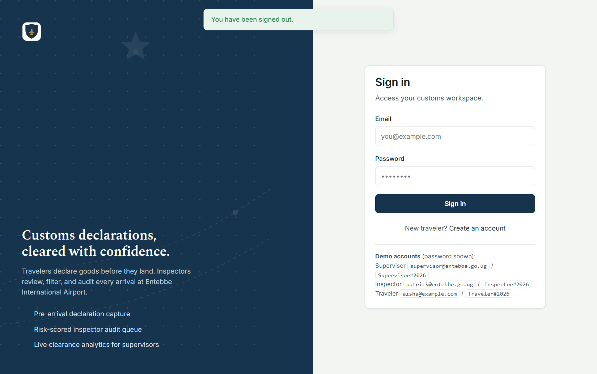
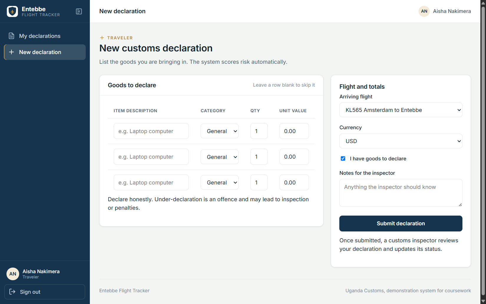
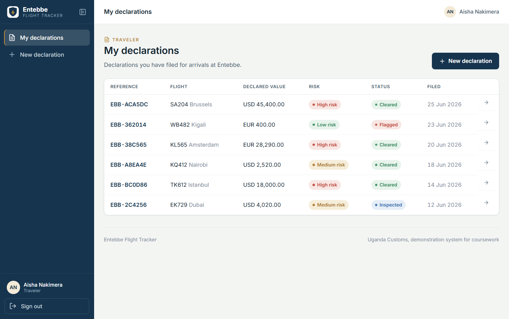
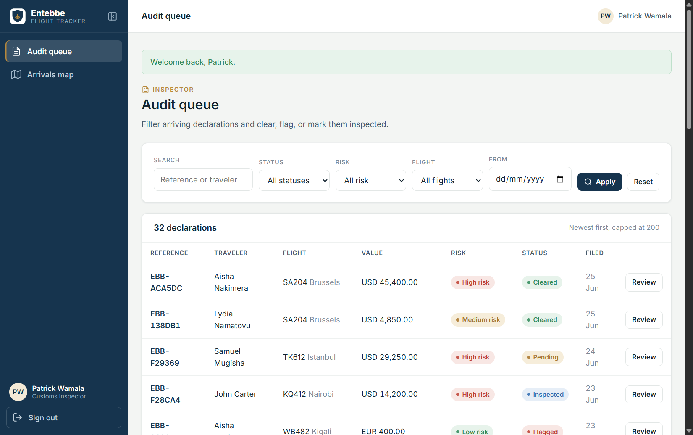
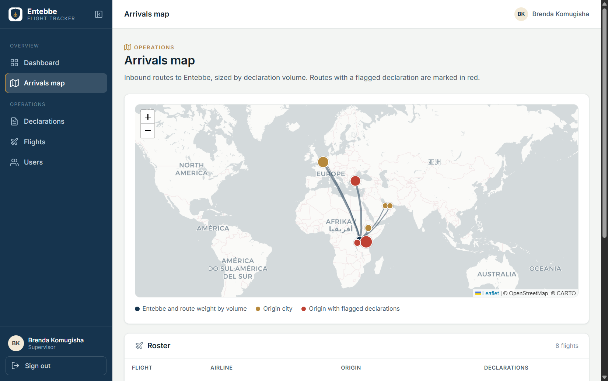
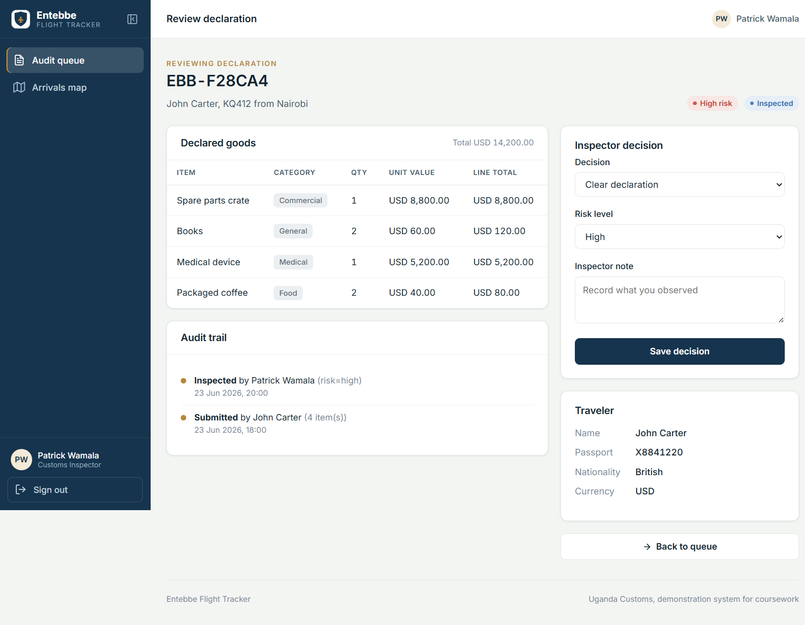
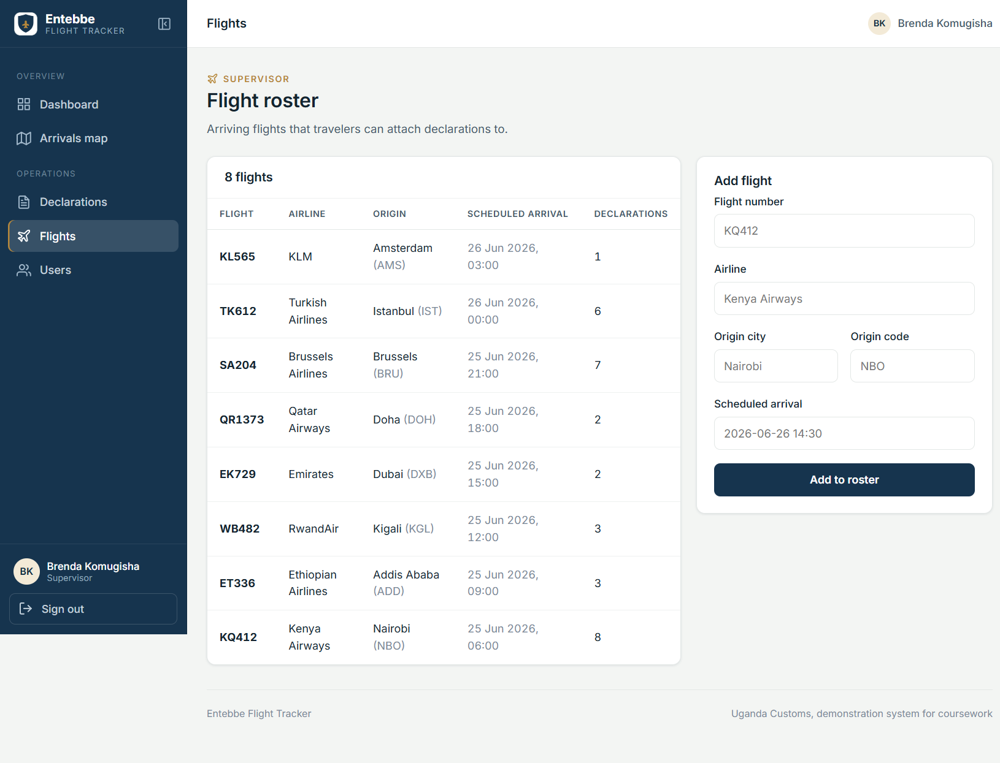
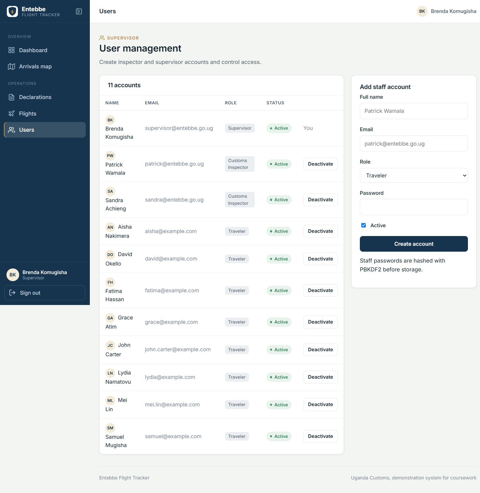

# User Manual: Entebbe Flight Tracker

A short onboarding guide for the three roles in the system. For setup and
installation, see the project `README.md`.

Sign in at the home page. The demo accounts are listed on the sign-in screen.

---

## 1. Traveler

**Goal: declare your goods before you land, then track clearance.**

**Sign in or register.** New travelers click "Create an account" on the sign-in
page. Registration always creates a traveler account.

**File a declaration.** Open "New declaration". Pick your arriving flight and
currency, list each item with its category, quantity, and value, and add a note if
needed. Leave a row blank to skip it. Submit when done. The system gives the
declaration a reference such as `EBB-1A2B3C` and a risk level.

**Track your declarations.** "My declarations" lists everything you have filed,
with its risk and current status (pending, cleared, flagged, or inspected). Open
any one to see the goods and any note the inspector left.

You can only ever see your own declarations.

---

## 2. Customs inspector

**Goal: triage the audit queue and record a decision on each declaration.**

**Work the queue.** "Audit queue" lists arriving declarations, newest first. Use
the filter bar to narrow by search text (reference or traveler), status, risk
band, flight, or date. Filters combine, so you can ask for, say, high risk and
flagged on one flight.

Every row is clickable, and the left sidebar can be collapsed to icons with the
button next to the logo.

**See where arrivals come from.** The "Arrivals map" shows each origin city with a
route to Entebbe, weighted by how many declarations came in on it. Cities with a
flagged declaration are marked in red.

**Review and decide.** Click "Review" on a row. You see the full goods list, the
running total, the traveler's passport details, and the audit trail. Choose a
decision (clear, flag for follow up, or mark physically inspected), confirm or
adjust the risk level, add a note, and save. Your action is written to the audit
trail with your name and the time.

---

## 3. Supervisor

**Goal: watch clearance throughput and manage flights and staff.**

**Read the dashboard.** The dashboard opens on sign in. The tiles show total
declarations, how many await review, the flagged rate, and total declared value.
Below are the 14-day volume trend, the status and risk breakdowns, the busiest
flights, declared value by category, and a recent activity feed. All figures
update from the database.

**Manage flights.** "Flights" shows the arrival roster and how many declarations
each flight carries. Add a flight with its number, airline, origin, and scheduled
arrival (for example `2026-06-26 14:30`). Travelers can then declare against it.

**Manage users.** "Users" lists all accounts. Create an inspector or supervisor
account by giving a name, email, role, and an initial password (hashed on save).
Deactivate an account to revoke its access at once. You cannot deactivate your own
account.

---

**Signing out.** Use "Sign out" at the top right on any page. This is the only way
to end a session, and it clears the session cookie.
